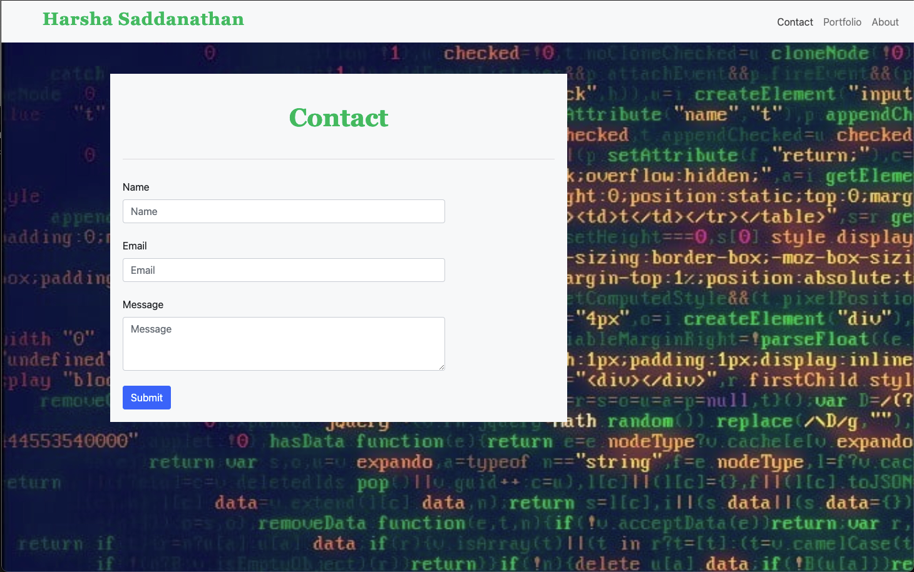

# React Portfolio

## Summary
In this assignment, we were tasked with creating a Portfolio using React.
## Instruction

Navigate to the following Github repository:
    https://github.com/hsaddanathan/react-portfolio

Across the top of the page, click on the Fork button on the right.

Once you have done this, you will see the repo copied within your Github account

Click the Green "Code" Button, and copy repo link. 

Open Terminal and run "git clone (Paste Link Here)"

Once repo has been cloned, you can run " code ." to open in Visual Studio Code. 

From there, open your terminal inside VS Code by using the keyboard shortcut "Ctrl + `. 

Next, type "npm install" to install dependencies.

Once you have done this, type "npm start".

Then, you can navigate to http://localhost:3000. 

Alternatively, you can navigate to https://hsaddanathan.github.io/react-portfolio/ and view my portfolio from there.

## Technology Used
    * node.js
    * Javascript
    * React
    * React-Router-DOM
    * Form Spree
    
## Demo

## Links

React Portfolio Github Pages URL:
    https://hsaddanathan.github.io/react-portfolio

React Portfolio GitHub Repo:
    https://github.com/hsaddanathan/react-portfolio

## Contributors 
[@hsaddanathan](https://github.com/hsaddanathan)

## License
